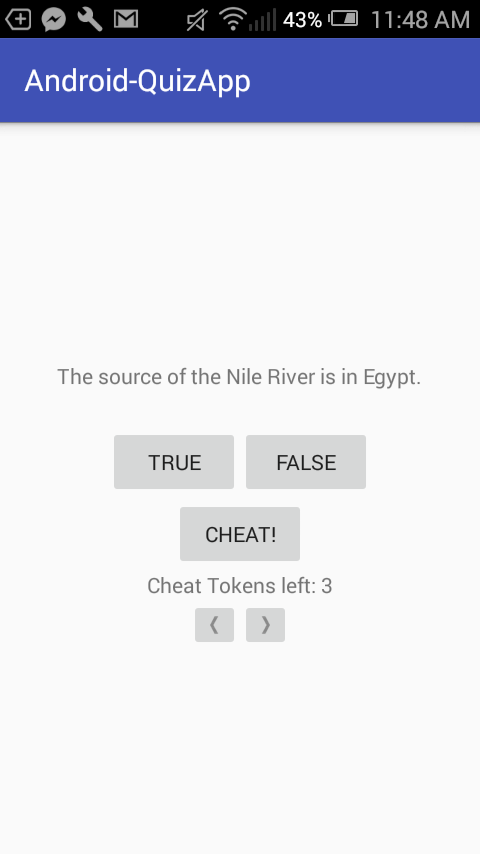
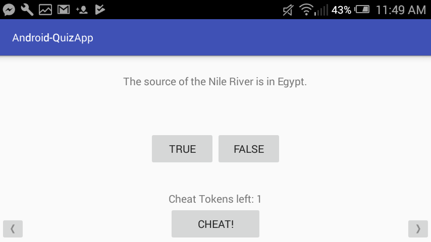
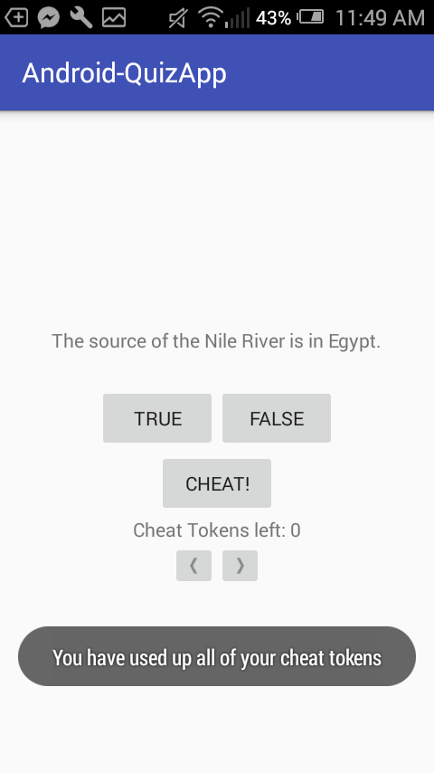

# Android-QuizApp


**Functionalities:**
1. Answer questions with True/False. The answer will show up as a Toast ("Incorrect"/"Correct")
2. Move to a new question by pressing Next button ('>' Button), back up one question by '<'
3. Player is able to cheat (Pressing Cheat Button) and he/she will have only 3 chances to cheat. When all three chances are used, the cheat button will warn and deny the attempt to cheat
4. A cheat only counts when the play presses 'Show Answer' Button (in the Cheat Activity). And Cheat Activity will talk back to Quiz Activity if the player actually cheats or not. (**This demonstrates an interaction betwwen 2 activities**)
5. Keep track of the API the app is build on.

**Main Activity View**



**Landscape View**
```diff
By saving all essential information into savedInstanceState, rotating the phone does not affect the app.
```


**Cheat Activity View**

The answer only shows up when 'Show Answer' is pressed.


**No Cheat Tokens Left**

Warn the player when he tries to uses his cheat.
```diff
Again, this demonstrates the interaction betwwen 2 activities
```

